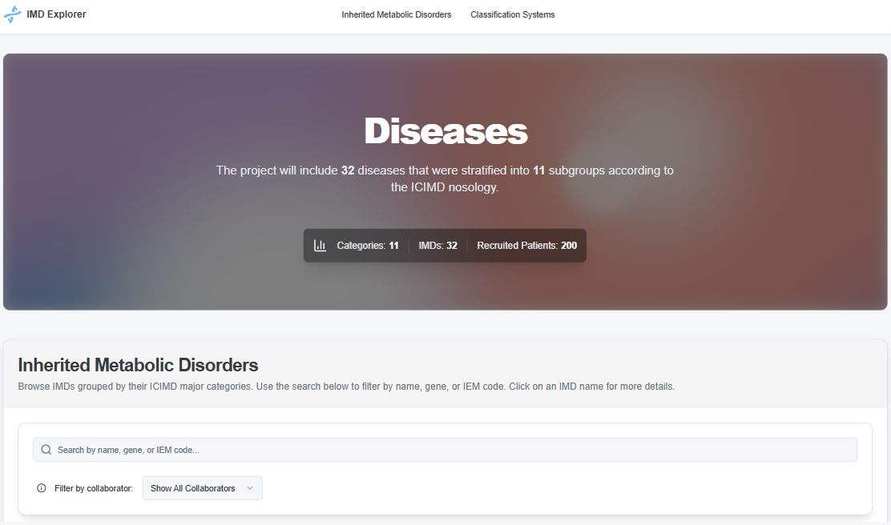
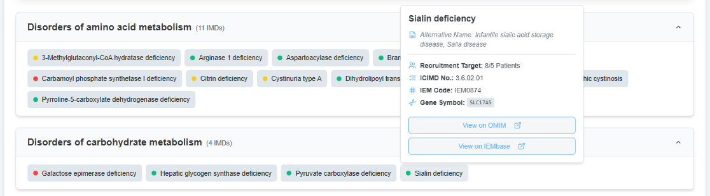

#  IMD Explorer



This is a web-based application designed to explore Inherited Metabolic Disorders (IMDs) that are listed in a studies recruitment plan. It provides a filterable and searchable interface to browse IMDs, view recruitment targets, and understand the classification systems used. It also enables users in a multi-centre study to quickly identify eligible patients for recruitment on their respective site.

---

## Installation & Development

1. **Install dependencies:**
   ```
   npm install
   ```

2. **Run the development server:**
   ```
   npm run dev
   ```
   The app will be available at [http://localhost:3000](http://localhost:3000).

3. **Build for production (static export):**
   ```
   npm run build
   ```
   The output will be in the `out` folder, which can then be hosted statically.

---

## Key Components & Features



### 1. Inherited Metabolic Disorders (IMDs) List
- **Categorized View**: IMDs are grouped by their major [ICIMD](http://www.icimd.org/) categories in an accordion-style layout.
- **Dynamic Search**: Filter IMDs by name, gene symbol, or IEM nosology code.
- **Collaborator-Specific Filtering**: Additionally users can view the recruitment plan for specific collaborators, showing which IMDs are "Prescribed" or "Flexible" for them.
- **Recruitment Status**: Each IMD is color-coded to indicate recruitment progress (target met, in progress, or not started).

### 2. IMD Details
- Clicking on an IMD reveals a detailed card with:
  - Recruitment target progress (e.g., "5/10 Patients").
  - Key identifiers like ICIMD and IEM Nosology Codes.
  - The associated Gene Symbol.
  - Direct links to external databases like [OMIM](https://www.omim.org/) and [IEMbase](https://www.iembase.org/).

### 3. Classification Systems
- An overview of the key classification systems relevant to metabolic disorders, such as ATC, ICIMD, OMIM, and HPO, with links to learn more about each.

---

## Data Sources & Setup

The application is sourcing data from three CSV files located in the `/public` directory. For the explorer to function correctly, these files must be present and formatted as described below (check out the sample csv files provided for reference).

### CSV File Setup

*   `info.csv`
    *   **Purpose**: Contains the primary information for each Inherited Metabolic Disorder and serves as a lookup dictionary.
    *   **Required Columns**:
        *   `Name`: The full name of the disorder.
        *   `AlternativeNames`: Alternative names for the disorder.
        *   `DiseaseAbbreviation`: Abbreviation for the disease. (Will be hidden, but matches for search)
        *   `ICIMDNosologyNumber`: The official ICIMD classification number.
        *   `IEMNosologyCode`: The IEM Nosology Code for the disorder.
        *   `IEMBase_ID`: The ID for the disorder on the IEMbase website: `https://www.iembase.com/disorder/<ID>`.
        *   `OMIM`: The ID for the disorder in OMIM: `https://omim.org/entry/<ID>`.
        *   `GeneSymbol`: The gene symbol associated with the disorder.

*   `recruitment_plan.csv`
    *   **Purpose**: Defines the recruitment plan, linking IMDs to collaborators and specifying targets.
    *   **Required Columns**:
        *   `GeneSymbol`: Used to map the plan to the IMD in `info.csv`.
        *   `minGroupSize`: The target number of patients to recruit.
        *   `IMDstatus`: The application is setup to read 'Prescribed' or 'Flexible' for IMDs that are part of a specific collaborator (/group of collaborators) recruitment plan or open for everyone to recruit.
        *   `Collaborators`: A comma-separated list of collaborator identifiers. The application will keep track of collaborators that are listed here.

*   `recruited.csv`
    *   **Purpose**: A list of patients who have been recruited. The application counts the occurrences of each unique code to determine recruitment progress.
    *   **Required Columns**:
        *   `IEMNosologyCode`: The IEM Nosology Code for the patient's diagnosed disorder.
        *   `Collaborator`: The collaborator who recruited the patient.

---

## Acknowledgements & Licensing

This project was built using open-source libraries which shall be acknowledged here:

*   **Framework**: [Next.js](https://nextjs.org/) (licensed under MIT)
*   **UI Library**: [React](https://react.dev/) (licensed under MIT)
*   **Styling**: [Tailwind CSS](https://tailwindcss.com/) (licensed under MIT)
*   **UI Components**: [shadcn/ui](https://ui.shadcn.com/) (licensed under MIT)
*   **Icons**: [Lucide](https://lucide.dev/) (licensed under ISC)
*   **CSV Parsing**: [Papa Parse](https://www.papaparse.com/) (licensed under MIT)

### Project License

This project is licensed under the [MIT License](LICENSE).

You are free to use, modify, and distribute this software with attribution.